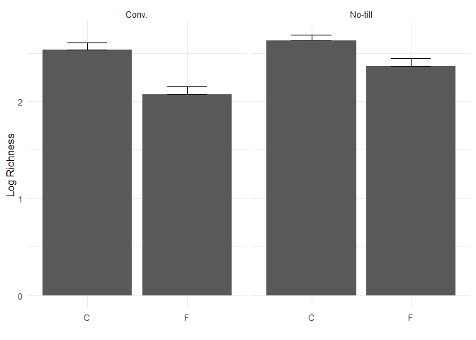

    library(tidyverse)

    ## ── Attaching core tidyverse packages ──────────────────────── tidyverse 2.0.0 ──
    ## ✔ dplyr     1.1.4     ✔ readr     2.1.5
    ## ✔ forcats   1.0.0     ✔ stringr   1.5.1
    ## ✔ ggplot2   3.5.1     ✔ tibble    3.2.1
    ## ✔ lubridate 1.9.4     ✔ tidyr     1.3.1
    ## ✔ purrr     1.0.2     
    ## ── Conflicts ────────────────────────────────────────── tidyverse_conflicts() ──
    ## ✖ dplyr::filter() masks stats::filter()
    ## ✖ dplyr::lag()    masks stats::lag()
    ## ℹ Use the conflicted package (<http://conflicted.r-lib.org/>) to force all conflicts to become errors

    library(readr)
    microbiome.fungi <- read.csv("Bull_richness.csv")
    str(microbiome.fungi)

    ## 'data.frame':    287 obs. of  16 variables:
    ##  $ SampleID       : chr  "Corn2017LeafObjective2Collection1T1R1CAH2" "Corn2017LeafObjective2Collection1T1R1CBA3" "Corn2017LeafObjective2Collection1T1R1CCB3" "Corn2017LeafObjective2Collection1T1R1FAC3" ...
    ##  $ Crop           : chr  "Corn" "Corn" "Corn" "Corn" ...
    ##  $ Objective      : chr  "Objective 2" "Objective 2" "Objective 2" "Objective 2" ...
    ##  $ Collection     : int  1 1 1 1 1 1 1 1 1 1 ...
    ##  $ Compartment    : chr  "Leaf" "Leaf" "Leaf" "Leaf" ...
    ##  $ DateSampled    : chr  "6/26/17" "6/26/17" "6/26/17" "6/26/17" ...
    ##  $ GrowthStage    : chr  "V6" "V6" "V6" "V6" ...
    ##  $ Treatment      : chr  "Conv." "Conv." "Conv." "Conv." ...
    ##  $ Rep            : chr  "R1" "R1" "R1" "R1" ...
    ##  $ Sample         : chr  "A" "B" "C" "A" ...
    ##  $ Fungicide      : chr  "C" "C" "C" "F" ...
    ##  $ Target_organism: chr  "Fungi" "Fungi" "Fungi" "Fungi" ...
    ##  $ Location       : chr  "Kellogg Biological Station" "Kellogg Biological Station" "Kellogg Biological Station" "Kellogg Biological Station" ...
    ##  $ Experiment     : chr  "LTER" "LTER" "LTER" "LTER" ...
    ##  $ Year           : int  2017 2017 2017 2017 2017 2017 2017 2017 2017 2017 ...
    ##  $ richness       : int  9 6 5 7 4 2 3 8 4 4 ...

\####‘select()’

    microbiome.fungi2<- select(microbiome.fungi, SampleID, Crop, Compartment: Fungicide, richness)

\####‘filter()’

    head(filter(microbiome.fungi2, Treatment =="Conv."))

    ##                                    SampleID Crop Compartment DateSampled
    ## 1 Corn2017LeafObjective2Collection1T1R1CAH2 Corn        Leaf     6/26/17
    ## 2 Corn2017LeafObjective2Collection1T1R1CBA3 Corn        Leaf     6/26/17
    ## 3 Corn2017LeafObjective2Collection1T1R1CCB3 Corn        Leaf     6/26/17
    ## 4 Corn2017LeafObjective2Collection1T1R1FAC3 Corn        Leaf     6/26/17
    ## 5 Corn2017LeafObjective2Collection1T1R1FBD3 Corn        Leaf     6/26/17
    ## 6 Corn2017LeafObjective2Collection1T1R1FCE3 Corn        Leaf     6/26/17
    ##   GrowthStage Treatment Rep Sample Fungicide richness
    ## 1          V6     Conv.  R1      A         C        9
    ## 2          V6     Conv.  R1      B         C        6
    ## 3          V6     Conv.  R1      C         C        5
    ## 4          V6     Conv.  R1      A         F        7
    ## 5          V6     Conv.  R1      B         F        4
    ## 6          V6     Conv.  R1      C         F        2

    # A more complex using &
    head(filter(microbiome.fungi2, Treatment == "Conv." & Fungicide == "C"))

    ##                                    SampleID Crop Compartment DateSampled
    ## 1 Corn2017LeafObjective2Collection1T1R1CAH2 Corn        Leaf     6/26/17
    ## 2 Corn2017LeafObjective2Collection1T1R1CBA3 Corn        Leaf     6/26/17
    ## 3 Corn2017LeafObjective2Collection1T1R1CCB3 Corn        Leaf     6/26/17
    ## 4 Corn2017LeafObjective2Collection1T1R2CAF3 Corn        Leaf     6/26/17
    ## 5 Corn2017LeafObjective2Collection1T1R2CBG3 Corn        Leaf     6/26/17
    ## 6 Corn2017LeafObjective2Collection1T1R2CCH3 Corn        Leaf     6/26/17
    ##   GrowthStage Treatment Rep Sample Fungicide richness
    ## 1          V6     Conv.  R1      A         C        9
    ## 2          V6     Conv.  R1      B         C        6
    ## 3          V6     Conv.  R1      C         C        5
    ## 4          V6     Conv.  R2      A         C        3
    ## 5          V6     Conv.  R2      B         C        8
    ## 6          V6     Conv.  R2      C         C        4

    #Another more complex example using or |
    head(filter(microbiome.fungi2, Sample == "A" | Sample == "B")) # Samples A or B

    ##                                    SampleID Crop Compartment DateSampled
    ## 1 Corn2017LeafObjective2Collection1T1R1CAH2 Corn        Leaf     6/26/17
    ## 2 Corn2017LeafObjective2Collection1T1R1CBA3 Corn        Leaf     6/26/17
    ## 3 Corn2017LeafObjective2Collection1T1R1FAC3 Corn        Leaf     6/26/17
    ## 4 Corn2017LeafObjective2Collection1T1R1FBD3 Corn        Leaf     6/26/17
    ## 5 Corn2017LeafObjective2Collection1T1R2CAF3 Corn        Leaf     6/26/17
    ## 6 Corn2017LeafObjective2Collection1T1R2CBG3 Corn        Leaf     6/26/17
    ##   GrowthStage Treatment Rep Sample Fungicide richness
    ## 1          V6     Conv.  R1      A         C        9
    ## 2          V6     Conv.  R1      B         C        6
    ## 3          V6     Conv.  R1      A         F        7
    ## 4          V6     Conv.  R1      B         F        4
    ## 5          V6     Conv.  R2      A         C        3
    ## 6          V6     Conv.  R2      B         C        8

#### ‘mutate()’

Mutate allow us to quickly create new columns

    microbiome.fungi2$logRich<- log(microbiome.fungi2$richness)
    #Create a new column called logRich
    head(mutate(microbiome.fungi2, logRich = log(richness)))

    ##                                    SampleID Crop Compartment DateSampled
    ## 1 Corn2017LeafObjective2Collection1T1R1CAH2 Corn        Leaf     6/26/17
    ## 2 Corn2017LeafObjective2Collection1T1R1CBA3 Corn        Leaf     6/26/17
    ## 3 Corn2017LeafObjective2Collection1T1R1CCB3 Corn        Leaf     6/26/17
    ## 4 Corn2017LeafObjective2Collection1T1R1FAC3 Corn        Leaf     6/26/17
    ## 5 Corn2017LeafObjective2Collection1T1R1FBD3 Corn        Leaf     6/26/17
    ## 6 Corn2017LeafObjective2Collection1T1R1FCE3 Corn        Leaf     6/26/17
    ##   GrowthStage Treatment Rep Sample Fungicide richness   logRich
    ## 1          V6     Conv.  R1      A         C        9 2.1972246
    ## 2          V6     Conv.  R1      B         C        6 1.7917595
    ## 3          V6     Conv.  R1      C         C        5 1.6094379
    ## 4          V6     Conv.  R1      A         F        7 1.9459101
    ## 5          V6     Conv.  R1      B         F        4 1.3862944
    ## 6          V6     Conv.  R1      C         F        2 0.6931472

    #Create a new Column which combine crop and treatment
    head(mutate(microbiome.fungi2, Crop_Treatment = paste(Crop, Treatment)))

    ##                                    SampleID Crop Compartment DateSampled
    ## 1 Corn2017LeafObjective2Collection1T1R1CAH2 Corn        Leaf     6/26/17
    ## 2 Corn2017LeafObjective2Collection1T1R1CBA3 Corn        Leaf     6/26/17
    ## 3 Corn2017LeafObjective2Collection1T1R1CCB3 Corn        Leaf     6/26/17
    ## 4 Corn2017LeafObjective2Collection1T1R1FAC3 Corn        Leaf     6/26/17
    ## 5 Corn2017LeafObjective2Collection1T1R1FBD3 Corn        Leaf     6/26/17
    ## 6 Corn2017LeafObjective2Collection1T1R1FCE3 Corn        Leaf     6/26/17
    ##   GrowthStage Treatment Rep Sample Fungicide richness   logRich Crop_Treatment
    ## 1          V6     Conv.  R1      A         C        9 2.1972246     Corn Conv.
    ## 2          V6     Conv.  R1      B         C        6 1.7917595     Corn Conv.
    ## 3          V6     Conv.  R1      C         C        5 1.6094379     Corn Conv.
    ## 4          V6     Conv.  R1      A         F        7 1.9459101     Corn Conv.
    ## 5          V6     Conv.  R1      B         F        4 1.3862944     Corn Conv.
    ## 6          V6     Conv.  R1      C         F        2 0.6931472     Corn Conv.

#### ‘pipe()’

we will combine all the previous steps into one large string of
functions. The data from the previous step is transfered to the next
step.

    microbiome.fungi %>%
      select(SampleID, Crop, Compartment: Fungicide, richness) %>% #selecting columns
      filter(Treatment =="Conv.")%>% #sub-setting to only include the conventional treatment
      mutate(logRich = log(richness)) %>% #creating a new column of the log richness
      head() #displaying the first six rows

    ##                                    SampleID Crop Compartment DateSampled
    ## 1 Corn2017LeafObjective2Collection1T1R1CAH2 Corn        Leaf     6/26/17
    ## 2 Corn2017LeafObjective2Collection1T1R1CBA3 Corn        Leaf     6/26/17
    ## 3 Corn2017LeafObjective2Collection1T1R1CCB3 Corn        Leaf     6/26/17
    ## 4 Corn2017LeafObjective2Collection1T1R1FAC3 Corn        Leaf     6/26/17
    ## 5 Corn2017LeafObjective2Collection1T1R1FBD3 Corn        Leaf     6/26/17
    ## 6 Corn2017LeafObjective2Collection1T1R1FCE3 Corn        Leaf     6/26/17
    ##   GrowthStage Treatment Rep Sample Fungicide richness   logRich
    ## 1          V6     Conv.  R1      A         C        9 2.1972246
    ## 2          V6     Conv.  R1      B         C        6 1.7917595
    ## 3          V6     Conv.  R1      C         C        5 1.6094379
    ## 4          V6     Conv.  R1      A         F        7 1.9459101
    ## 5          V6     Conv.  R1      B         F        4 1.3862944
    ## 6          V6     Conv.  R1      C         F        2 0.6931472

#### ‘summarize()’

we can use ‘summarise()’ function to find things like mean and standard
deviations/errors.

    microbiome.fungi %>%
      select(SampleID, Crop, Compartment: Fungicide, richness) %>% #selecting columns
      filter(Treatment =="Conv.")%>% #sub-setting to only include the conventional treatment
      mutate(logRich = log(richness)) %>% #creating a new column of the log richness
      summarise(Mean.rich = mean(logRich)) #Calculating the overall mean log richness within the conventionally managed treatment

    ##   Mean.rich
    ## 1  2.304395

we can also connect multiple summary statistics here.

    microbiome.fungi %>%
      select(SampleID, Crop, Compartment: Fungicide, richness) %>% #selecting columns
      filter(Treatment =="Conv.")%>% #sub-setting to only include the conventional treatment
      mutate(logRich = log(richness)) %>% #creating a new column of the log richness
      summarise(Mean.rich = mean(logRich), 
              n = n(),
              sd.dv = sd(logRich)) %>%
      mutate(std.err = sd.dv/sqrt(n))  #Calculating the mean richness, standard deviation nd standard error

    ##   Mean.rich   n     sd.dv   std.err
    ## 1  2.304395 144 0.7024667 0.0585389

In the order to see summart statistics by group! we can do that using
‘group\_by()’ function.

    microbiome.fungi %>%
      select(SampleID, Crop, Compartment: Fungicide, richness) %>% #selecting columns
      group_by(Treatment, Fungicide)%>% #grouping the treatment and fungicide to later calculate summary stats by the group
      mutate(logRich = log(richness)) %>% #creating a new column of the log richness
      summarise(Mean.rich = mean(logRich), 
              n = n(),
              sd.dv = sd(logRich)) %>%
      mutate(std.err = sd.dv/sqrt(n))  #Calculating the mean richness, standard deviation nd standard error

    ## `summarise()` has grouped output by 'Treatment'. You can override using the
    ## `.groups` argument.

    ## # A tibble: 4 × 6
    ## # Groups:   Treatment [2]
    ##   Treatment Fungicide Mean.rich     n sd.dv std.err
    ##   <chr>     <chr>         <dbl> <int> <dbl>   <dbl>
    ## 1 Conv.     C              2.53    72 0.635  0.0748
    ## 2 Conv.     F              2.07    72 0.696  0.0820
    ## 3 No-till   C              2.63    72 0.513  0.0604
    ## 4 No-till   F              2.36    71 0.680  0.0807

Adding a ggplot

    microbiome.fungi %>%
      select(SampleID, Crop, Compartment: Fungicide, richness) %>% #selecting columns
      group_by(Treatment, Fungicide)%>% #grouping the treatment and fungicide to later calculate summary stats by the group
      mutate(logRich = log(richness)) %>% #creating a new column of the log richness
      summarise(Mean.rich = mean(logRich), 
              n = n(),
              sd.dv = sd(logRich)) %>%
      mutate(std.err = sd.dv/sqrt(n))  %>%
      ggplot(aes(x= Fungicide, y = Mean.rich))+   #adding a ggplot
      geom_bar(stat = "identity")+
      geom_errorbar(aes(x= Fungicide, ymin = Mean.rich, ymax = Mean.rich+ std.err), width = 0.4)+
      theme_minimal()+
      xlab("")+
      ylab("Log Richness")+
      facet_wrap(~ Treatment)

    ## `summarise()` has grouped output by 'Treatment'. You can override using the
    ## `.groups` argument.

#### Joining

We can do match up of data by rows using joining function

-left\_join() - Keep all rows of x and add matching row from y. Any row
that dont match x will be excluded.

-right\_join - reverse of left join()

-inner\_join() - only keep rows that are common to both X and Y

-fully\_join() - Keep any columns that are in either X or Y

We have to create a metadata and taxonomy using ‘sample()’ function

    #Select just richness and sample ID
    richness<- microbiome.fungi %>%
      select(SampleID, richness)

    #Selecting columns that dont include the richness
    metadata<- microbiome.fungi %>%
      select(SampleID, Fungicide, Crop, Compartment, GrowthStage, Treatment, Rep, Sample)

    head(metadata)

    ##                                    SampleID Fungicide Crop Compartment
    ## 1 Corn2017LeafObjective2Collection1T1R1CAH2         C Corn        Leaf
    ## 2 Corn2017LeafObjective2Collection1T1R1CBA3         C Corn        Leaf
    ## 3 Corn2017LeafObjective2Collection1T1R1CCB3         C Corn        Leaf
    ## 4 Corn2017LeafObjective2Collection1T1R1FAC3         F Corn        Leaf
    ## 5 Corn2017LeafObjective2Collection1T1R1FBD3         F Corn        Leaf
    ## 6 Corn2017LeafObjective2Collection1T1R1FCE3         F Corn        Leaf
    ##   GrowthStage Treatment Rep Sample
    ## 1          V6     Conv.  R1      A
    ## 2          V6     Conv.  R1      B
    ## 3          V6     Conv.  R1      C
    ## 4          V6     Conv.  R1      A
    ## 5          V6     Conv.  R1      B
    ## 6          V6     Conv.  R1      C

    head(richness)

    ##                                    SampleID richness
    ## 1 Corn2017LeafObjective2Collection1T1R1CAH2        9
    ## 2 Corn2017LeafObjective2Collection1T1R1CBA3        6
    ## 3 Corn2017LeafObjective2Collection1T1R1CCB3        5
    ## 4 Corn2017LeafObjective2Collection1T1R1FAC3        7
    ## 5 Corn2017LeafObjective2Collection1T1R1FBD3        4
    ## 6 Corn2017LeafObjective2Collection1T1R1FCE3        2

    head(left_join(metadata, richness, by = "SampleID")) #Adding richness data to metadata on the common column of the sample ID

    ##                                    SampleID Fungicide Crop Compartment
    ## 1 Corn2017LeafObjective2Collection1T1R1CAH2         C Corn        Leaf
    ## 2 Corn2017LeafObjective2Collection1T1R1CBA3         C Corn        Leaf
    ## 3 Corn2017LeafObjective2Collection1T1R1CCB3         C Corn        Leaf
    ## 4 Corn2017LeafObjective2Collection1T1R1FAC3         F Corn        Leaf
    ## 5 Corn2017LeafObjective2Collection1T1R1FBD3         F Corn        Leaf
    ## 6 Corn2017LeafObjective2Collection1T1R1FCE3         F Corn        Leaf
    ##   GrowthStage Treatment Rep Sample richness
    ## 1          V6     Conv.  R1      A        9
    ## 2          V6     Conv.  R1      B        6
    ## 3          V6     Conv.  R1      C        5
    ## 4          V6     Conv.  R1      A        7
    ## 5          V6     Conv.  R1      B        4
    ## 6          V6     Conv.  R1      C        2

#### Pivoting

It convert wide to long format data and back again. we can do that using
‘pivot\_longer()’ and ‘pivot\_wider()’ Our data is wide format we will
convert it into long format

    microbiome.fungi%>%
      select(SampleID,Crop, Compartment:Fungicide, richness) %>%
      group_by(Treatment, Fungicide) %>% #grouping to later calculate summary stats by group
      summarise(Mean = mean(richness)) #Calculate the mean per treatment and fungicide

    ## `summarise()` has grouped output by 'Treatment'. You can override using the
    ## `.groups` argument.

    ## # A tibble: 4 × 3
    ## # Groups:   Treatment [2]
    ##   Treatment Fungicide  Mean
    ##   <chr>     <chr>     <dbl>
    ## 1 Conv.     C         14.6 
    ## 2 Conv.     F          9.75
    ## 3 No-till   C         15.4 
    ## 4 No-till   F         13.1

    microbiome.fungi%>%
      select(SampleID,Crop, Compartment:Fungicide, richness) %>%
      group_by(Treatment, Fungicide) %>% #grouping to later calculate summary stats by group
     summarise(Mean = mean(richness))%>%     #Calculate the mean per treatment and fungicide
       pivot_wider(names_from = Fungicide, values_from = Mean) #pivot to wider format

    ## `summarise()` has grouped output by 'Treatment'. You can override using the
    ## `.groups` argument.

    ## # A tibble: 2 × 3
    ## # Groups:   Treatment [2]
    ##   Treatment     C     F
    ##   <chr>     <dbl> <dbl>
    ## 1 Conv.      14.6  9.75
    ## 2 No-till    15.4 13.1

Difference between fungicide and control now

    microbiome.fungi%>%
     select(SampleID, Crop, Compartment: Fungicide, richness) %>%
      group_by(Treatment, Fungicide) %>% #grouping to later calculate summary stats by group
     summarise(Mean = mean(richness))%>%     #Calculate the mean per treatment and fungicide
       pivot_wider(names_from = Fungicide, values_from = Mean)%>% #pivot to wider format
       mutate(diff.fungicide = C - F) #Calculating the difference between the means

    ## `summarise()` has grouped output by 'Treatment'. You can override using the
    ## `.groups` argument.

    ## # A tibble: 2 × 4
    ## # Groups:   Treatment [2]
    ##   Treatment     C     F diff.fungicide
    ##   <chr>     <dbl> <dbl>          <dbl>
    ## 1 Conv.      14.6  9.75           4.89
    ## 2 No-till    15.4 13.1            2.32
