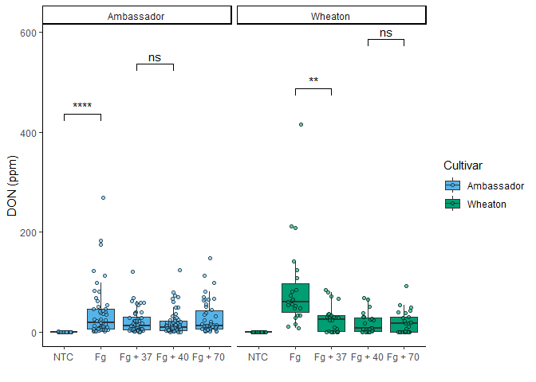
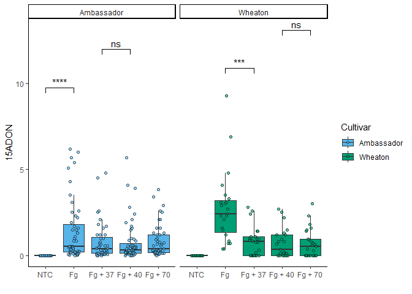
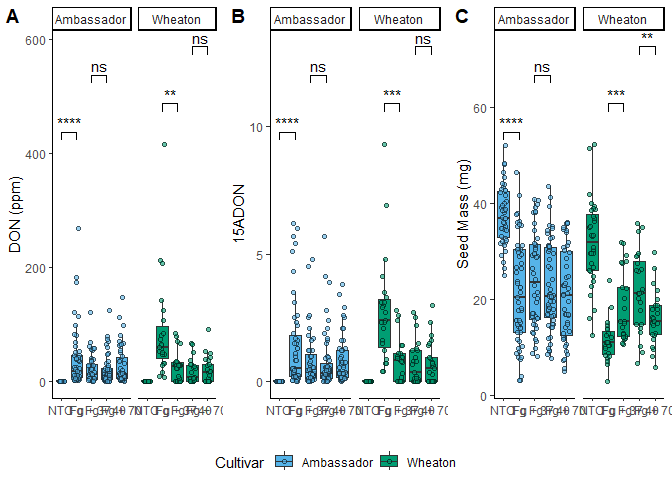

# Coding Challenge 4

## **Q.No.3 (a)**

### Readme file link

``` r
library(knitr)
```

[link to my Markdown fil](README.md)

### Clickable Link to the Manuscript

[Manuscript Link](https://doi.org/10.1094/PDIS-06-21-1253-RE)

## **Q.No.6 (b)**

## File Tree of Github

``` r
 fs::dir_tree()
```

    ## .
    ## ├── coding challenge_4 Reproducibility.Rmd
    ## ├── coding-challenge_4-Reproducibility.html
    ## ├── coding-challenge_4-Reproducibility.md
    ## ├── coding-challenge_4-Reproducibility.pdf
    ## ├── coding-challenge_4-Reproducibility.Rmd
    ## ├── coding-challenge_4-Reproducibility_files
    ## │   └── figure-gfm
    ## │       ├── unnamed-chunk-6-1.png
    ## │       ├── unnamed-chunk-7-1.png
    ## │       └── unnamed-chunk-9-1.png
    ## ├── MycotoxinData.csv
    ## ├── README.html
    ## ├── README.md
    ## ├── README.pdf
    ## └── Reproducibility_5820.Rproj

### Libraries

``` r
library(readr)
library(ggplot2)
library(tidyverse)
```

    ## ── Attaching core tidyverse packages ──────────────────────── tidyverse 2.0.0 ──
    ## ✔ dplyr     1.1.4     ✔ stringr   1.5.1
    ## ✔ forcats   1.0.0     ✔ tibble    3.2.1
    ## ✔ lubridate 1.9.4     ✔ tidyr     1.3.1
    ## ✔ purrr     1.0.2     
    ## ── Conflicts ────────────────────────────────────────── tidyverse_conflicts() ──
    ## ✖ dplyr::filter() masks stats::filter()
    ## ✖ dplyr::lag()    masks stats::lag()
    ## ℹ Use the conflicted package (<http://conflicted.r-lib.org/>) to force all conflicts to become errors

``` r
library(ggpubr)
library(ggrepel) 
cbbPalette <- c("#000000", "#E69F00", "#56B4E9", "#009E73",
                "#F0E442", "#0072B2", "#D55E00", "#CC79A7")
```

## **Q.No.3 (b)**

### Importing the excel file

``` r
Mycotoxin_Data <- read.csv("MycotoxinData.csv",na = "na")
```

## **Q.No.3 (c) **

### Changing the factor levels

``` r
Mycotoxin_Data$Treatment <- factor(Mycotoxin_Data$Treatment, levels = c("NTC", "Fg", "Fg + 37", "Fg + 40", "Fg + 70"))
```

# Appling Statistics using t test

## a.

``` r
DONplot.pwc <- ggplot(Mycotoxin_Data, aes(x = Treatment, y = DON, fill = Cultivar)) +
  geom_boxplot(outliers = F) + 
  xlab("") + 
  ylab("DON (ppm)") + 
  geom_point(alpha = 0.6, pch = 21, color = "black", position = position_jitterdodge()) +
  scale_color_manual(values = c(cbbPalette[3], cbbPalette[4])) +
  scale_fill_manual(values = c(cbbPalette[3], cbbPalette[4])) +
  theme_classic() +
  facet_wrap(~Cultivar) +
  stat_compare_means(method = "t.test", label = "p.signif", 
                     comparisons = list(c("NTC", "Fg"), 
                                        c("Fg", "Fg + 37"), 
                                        c("Fg + 37", "Fg + 40"), 
                                        c("Fg + 40", "Fg + 70")))

DONplot.pwc
```

    ## Warning: Removed 8 rows containing non-finite outside the scale range
    ## (`stat_boxplot()`).

    ## Warning: Removed 8 rows containing non-finite outside the scale range
    ## (`stat_signif()`).

    ## Warning: Removed 8 rows containing missing values or values outside the scale range
    ## (`geom_point()`).

<!-- -->

## b.

``` r
X15ADONplot.pwc <- ggplot(Mycotoxin_Data, aes(x = Treatment, y = X15ADON, fill = Cultivar)) +
  geom_boxplot(outliers = F) + 
  xlab("") + 
  ylab("15ADON") + 
  geom_point(alpha = 0.6, pch = 21, color = "black", position = position_jitterdodge()) +
  scale_color_manual(values = c(cbbPalette[3], cbbPalette[4])) +
  scale_fill_manual(values = c(cbbPalette[3], cbbPalette[4])) +
  theme_classic() +
  facet_wrap(~Cultivar) +
  stat_compare_means(method = "t.test", label = "p.signif", 
                                        comparisons = list(c("NTC", "Fg"), 
                                                           c("Fg", "Fg + 37"), 
                                                           c("Fg + 37", "Fg + 40"), 
                                                           c("Fg + 40", "Fg + 70")))               
 X15ADONplot.pwc
```

    ## Warning: Removed 10 rows containing non-finite outside the scale range
    ## (`stat_boxplot()`).

    ## Warning: Removed 10 rows containing non-finite outside the scale range
    ## (`stat_signif()`).

    ## Warning: Removed 10 rows containing missing values or values outside the scale range
    ## (`geom_point()`).

<!-- -->

## c.

``` r
 Seed.massplot.pwc <- ggplot(Mycotoxin_Data, aes(x = Treatment, y = MassperSeed_mg, fill = Cultivar)) +
   geom_boxplot(outliers = F) + 
     xlab("") + 
   ylab("Seed Mass (mg)") + 
  geom_point(alpha = 0.6, pch = 21, color = "black", position = position_jitterdodge()) +
  scale_color_manual(values = c(cbbPalette[3], cbbPalette[4])) +
   scale_fill_manual(values = c(cbbPalette[3], cbbPalette[4])) +
    theme_classic() +
    facet_wrap(~Cultivar) +
    stat_compare_means(method = "t.test", label = "p.signif", 
                            comparisons = list(c("NTC", "Fg"), 
                                        c("Fg", "Fg + 37"), 
                                          c("Fg + 37", "Fg + 40"), 
                                             c("Fg + 40", "Fg + 70")))
```

## **Combining all plots with statistics**

``` r
Combineplot.pwc <- ggarrange( DONplot.pwc,
                                   X15ADONplot.pwc, 
                       Seed.massplot.pwc, 
                       labels = c("A", "B", "C"),
                       nrow = 1,
                       ncol = 3,
                       common.legend = TRUE,
                       legend = "bottom")
```

    ## Warning: Removed 8 rows containing non-finite outside the scale range
    ## (`stat_boxplot()`).

    ## Warning: Removed 8 rows containing non-finite outside the scale range
    ## (`stat_signif()`).

    ## Warning: Removed 8 rows containing missing values or values outside the scale range
    ## (`geom_point()`).

    ## Warning: Removed 8 rows containing non-finite outside the scale range
    ## (`stat_boxplot()`).

    ## Warning: Removed 8 rows containing non-finite outside the scale range
    ## (`stat_signif()`).

    ## Warning: Removed 8 rows containing missing values or values outside the scale range
    ## (`geom_point()`).

    ## Warning: Removed 10 rows containing non-finite outside the scale range
    ## (`stat_boxplot()`).

    ## Warning: Removed 10 rows containing non-finite outside the scale range
    ## (`stat_signif()`).

    ## Warning: Removed 10 rows containing missing values or values outside the scale range
    ## (`geom_point()`).

    ## Warning: Removed 2 rows containing non-finite outside the scale range
    ## (`stat_boxplot()`).

    ## Warning: Removed 2 rows containing non-finite outside the scale range
    ## (`stat_signif()`).

    ## Warning: Removed 2 rows containing missing values or values outside the scale range
    ## (`geom_point()`).

``` r
                     Combineplot.pwc
```

<!-- -->
